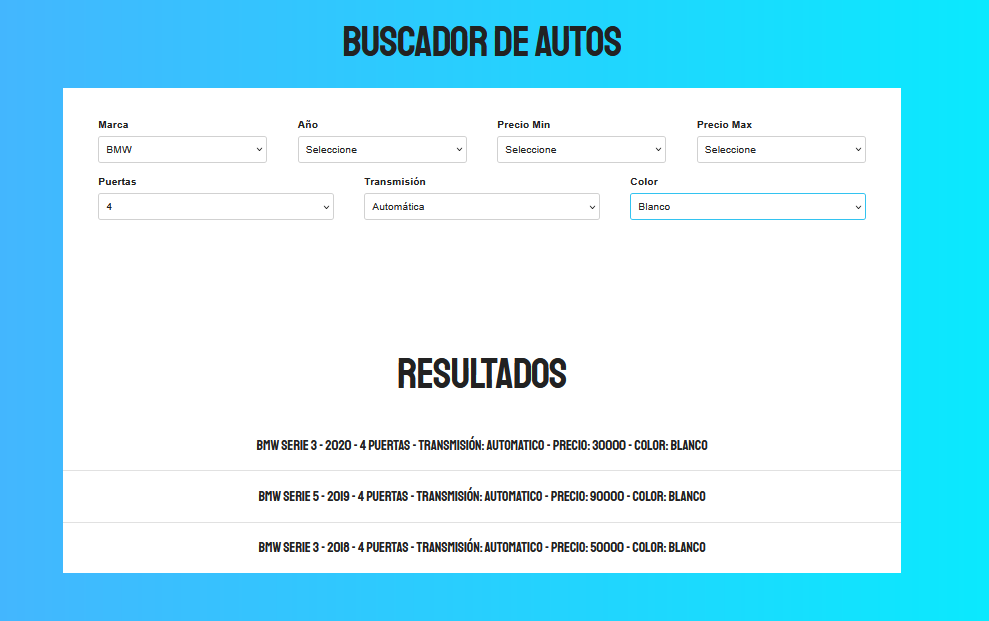

# Simulador de busquedas

Este es un proyecto creado con la finalidad de poder mostrar mis habilidades tecnicas en desarrollo con Javascript, en este caso el proyecto contiene una base de datos local, la cual sirve como fuente principal de datos, los cuales podemos filtrar de diferentes formas como por ejemplo por marca, color, precio etc. 

## Screenshots

## Tech Stack

**Frontend:** HTML, JavaScript y CSS

